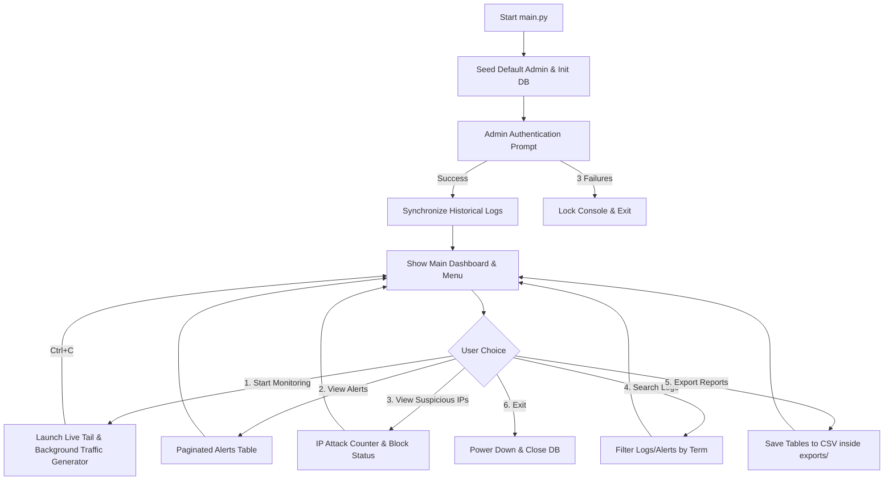

# SentinelX – Smart SOC Monitoring & Threat Detection System

SentinelX is a modular, console-based Security Operations Center (SOC) monitoring and threat detection system built in Python. It is designed to run locally in the terminal, read log files in real-time, evaluate entries against a built-in threat detection engine, log incidents to an SQLite database, track malicious IP addresses, and generate security reports.

This project is tailored for academic presentation, cybersecurity portfolios, resumes, and SOC analyst interview demonstrations.

---

## 📁 Folder Structure

The project is structured modularly to follow professional Python standards:

```text
Cyber/
│
├── main.py                 # Core application controller & Console UI menu
├── requirements.txt         # Project external dependencies (colorama)
├── sample_logs.txt         # Root-level copy of logs for initial testing
│
├── database/
│   ├── sentinelx.db        # SQLite database (generated dynamically at runtime)
│   └── .gitkeep            # Version control placeholder
│
├── logs/
│   └── sample_logs.txt     # Main active log file tailed by the application
│
├── exports/
│   └── (CSV Files)         # Target folder for exported security reports
│
└── modules/
    ├── __init__.py         # Marks modules directory as a Python package
    ├── auth.py             # Administrator login, credentials verification, password hashing
    ├── database.py         # SQLite connection manager and SQL query interface
    ├── logger.py           # Log file generator, parsing engine, and attack simulator
    └── detector.py         # Threat evaluation rules (brute force, SQL Injection, probing)
```

---

## ⚙️ How Brute Force Detection Works

Brute-force attack detection is handled using an **in-memory sliding window algorithm** inside `modules/detector.py`:

1. **Log Parsing**: The `Logger` parses each login attempt, extracting the `timestamp`, `ip`, `username`, and success/failure status.
2. **Failure Tracking**: If a login attempt fails, the IP address is added to a tracking dictionary, along with the epoch timestamp of the failure.
3. **Sliding Time Window Evaluation**: When a new failure occurs, the detector calculates the epoch difference between the current failure and all historical failures stored for that IP. Any failure timestamps older than **30 seconds** are discarded.
4. **Threshold Trigger**: If the remaining count of failed attempts from that single IP is **5 or more** within this 30-second window, a **HIGH severity alert** is generated:
   - The alert is saved to the SQLite database.
   - The in-memory tracking window for that IP is cleared to prevent a duplicate alert storm on every subsequent failure.
   - The attacker's IP status is updated in the database to `Flagged`, and if failures exceed 10, it is promoted to `Blocked`.

---

## 🔄 Project Flow & Lifecycle



1. **Initialize**: `main.py` checks for folder structures and runs database setups.
2. **Authenticate**: Prompts for password (hidden dynamically). The default is `admin` / `admin123` (stored hashed with SHA-256 in SQLite).
3. **Dashboard Sync**: On successful login, the detector runs a quick pass on the log file to sync previous events into the database.
4. **Dashboard & Menu**: Shows overall stats (Active Attackers, Total Alerts, Severity Count) in a colored panel and presents options.
5. **Real-Time Monitoring**:
   - Spawns a background thread that periodically writes simulated cyber events (successful logins, port scans, SQL injections, brute-force bursts) to the log file.
   - The main thread tails the log file, parses entries via regex, runs them through the threat detection engine, updates the SQLite database, and prints color-coded alerts to the terminal instantly.
   - Gracefully stops via `Ctrl+C` interrupt.

---

## 🛠️ How to Run in VS Code (Windows)

Follow these steps to run the project in VS Code:

### Prerequisites
1. **Python 3.x**: Ensure Python is installed. You can check by typing `python --version` in terminal.
2. **VS Code**: Visual Studio Code installed.

### Execution Steps
1. **Open Workspace**: Open VS Code, select **File -> Open Folder**, and open this `Cyber` folder.
2. **Open Integrated Terminal**: Open terminal in VS Code using the shortcut `Ctrl + ` ` ` (Ctrl + backtick) or **Terminal -> New Terminal**.
3. **Install Dependencies**: Install `colorama` for cross-platform color console rendering by typing:
   ```powershell
   pip install -r requirements.txt
   ```
4. **Run the Application**: Run the project using:
   ```powershell
   python main.py
   ```
5. **Log In**: 
   - Enter Username: `admin`
   - Enter Password: `admin123` (password input will be invisible as you type for security)
6. **Simulate**: Choose option `1` (Start Real-Time Monitoring). You will see traffic and high/medium/low alerts begin to populate in real-time. Press `Ctrl+C` when you wish to stop monitoring.

---

## 🛡️ File Descriptions

### 1. `main.py`
The orchestrator. It manages the CLI menus, dashboard screen clearing, live-feed thread management, paginated results rendering, and handles keyboard interrupts gracefully.

### 2. `modules/auth.py`
Implements SHA-256 secure password hashing and verification. Prompts for input securely using Python's `getpass` library to hide passwords.

### 3. `modules/database.py`
Controls SQLite databases. Contains schemas for users, logs, alerts, and suspicious IPs. Handles data filtration and aggregates dashboard statistics.

### 4. `modules/logger.py`
Pre-populates sample logs and opens a file handle to read appended lines dynamically. Includes a background event generator that simulates real-world attack vectors.

### 5. `modules/detector.py`
The intelligence core. Compares incoming traffic logs against rules:
- **LOW**: Authentication failure.
- **MEDIUM**: Privileged accounts (`root`, `oracle`) target validation, or web attacks.
- **HIGH**: Rapid successive failures (Brute Force) or terminal actions like database table drops.
